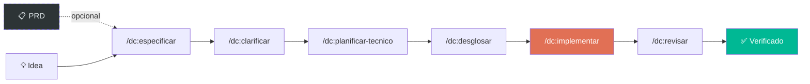

> 🌐 Leer en: [English](README.md) | [Español](README.es.md) | [Português](README.pt.md)

<p align="center">
  <h1 align="center">Don Cheli — SDD Framework</h1>
  <p align="center">
    <strong>Deja de adivinar. Empieza a hacer ingeniería.</strong><br/>
    <sub>El único framework donde TDD es ley, no una sugerencia.</sub>
  </p>
  <p align="center">
    <a href="#instalación"></a>
    
    
    
    
    <a href="https://marketplace.visualstudio.com/items?itemName=doncheli.don-cheli-sdd"></a>
    <br/>
    <a href="https://github.com/doncheli/don-cheli-sdd/actions/workflows/validar.yml"></a>
    <a href="https://codecov.io/gh/doncheli/don-cheli-sdd"></a>
  </p>
</p>

---

## Un comando. Código verificado.

```bash
/dc:auto "Implementar autenticación JWT con refresh tokens"
```

Don Cheli toma tu idea y entrega **código testeado, revisado y verificado** — automáticamente.

```
  ✅ /dc:especificar         8 escenarios Gherkin generados
  ✅ /dc:clarificar          2 ambigüedades resueltas
  ✅ /dc:planificar-tecnico  Blueprint: arquitectura 3 capas
  ✅ /dc:desglosar           7 tareas TDD creadas
  ✅ /dc:implementar         14 tests pasan, 91% cobertura
  ✅ /dc:revisar             7/7 dimensiones de review aprobadas

  Resultado: TODO PASÓ — Proyecto actualizado con código verificado
```

Tu proyecto queda **intacto** hasta que todo pase. Si algo falla, no cambia nada.

---

## Instalación

```bash
npm install -g don-cheli-sdd
don-cheli install --global
```

<details>
<summary>Otros métodos de instalación</summary>

```bash
# Git clone
git clone https://github.com/doncheli/don-cheli-sdd.git
cd don-cheli-sdd && bash scripts/instalar.sh

# Una línea
curl -fsSL https://raw.githubusercontent.com/doncheli/don-cheli-sdd/main/scripts/instalar.sh | bash -s -- --global --lang es

# Extensión VS Code
code --install-extension doncheli.don-cheli-sdd
```

</details>

---

## Cómo funciona



| Fase | Comando | Qué hace |
|------|---------|----------|
| Especificar | `/dc:especificar` | Tu idea → specs Gherkin con escenarios de test |
| Clarificar | `/dc:clarificar` | QA detecta ambigüedades antes de codear |
| Planificar | `/dc:planificar-tecnico` | Arquitectura + contratos API + schema |
| Desglosar | `/dc:desglosar` | Tareas TDD con marcadores de paralelismo |
| Implementar | `/dc:implementar` | Test PRIMERO → código → refactor (Ley de Hierro) |
| Revisar | `/dc:revisar` | Peer review en 7 dimensiones |

**Cada fase tiene una puerta de calidad.** No avanzas sin pasar. Sin atajos.

---

## 3 formas de usarlo

```bash
# Interactivo — tú diriges cada fase
/dc:comenzar "JWT auth"

# Autónomo — el runtime ejecuta todo, Docker aísla
/dc:auto "JWT auth"

# Terminal — sin agente IA abierto
don-cheli auto "JWT auth"
```

---

## Las Leyes de Hierro

No son sugerencias. El runtime las **fuerza**.

| Ley | Regla | Cómo se fuerza |
|-----|-------|----------------|
| **TDD** | Sin tests no hay código | Bloquea merge si no existen tests |
| **Sin Stubs** | No `// TODO` en producción | Escanea y rechaza |
| **Evidencia** | Pruebas, no promesas | Cobertura >= 85% verificada |

---

## Por qué Don Cheli

93 comandos · 51 habilidades · 15 modelos de razonamiento · 9 IDEs · 3 idiomas

El único framework SDD con **todo** esto:

- ✅ TDD como ley inquebrantable (no opcional)
- ✅ Modo autónomo con aislamiento Docker
- ✅ Auditoría OWASP en el pipeline
- ✅ 15 modelos de razonamiento (Pre-mortem, 5 Porqués, Pareto, RLM...)
- ✅ Generador de PRD (lee diseños de Figma)
- ✅ Simulación pre-flight de costos
- ✅ Crash recovery (retoma donde quedó)
- ✅ Quality gates custom (plugins YAML)
- ✅ Detección de drift (spec vs código)
- ✅ Badges de Certificación SDD
- ✅ Compatible con Claude, Cursor, Gemini, Codex, OpenCode, Qwen, Amp, Windsurf
- ✅ ES / EN / PT

[Comparación completa →](https://doncheli.tv/comousar.html)

---

## Plataformas

| Plataforma | Instalar | Detalle |
|-----------|----------|---------|
| **Claude Code** | `--tools claude` | 93 comandos `/dc:*` (nativo completo) |
| **OpenCode** | `--tools opencode` | 28 `/doncheli-*` slash commands + 28 skills |
| **Antigravity** | `--tools antigravity` | `GEMINI.md` + `.agent/skills/` |
| **Cursor** | `--tools cursor` | `.cursorrules` |
| **Codex / Qwen** | `--tools codex` | `AGENTS.md` |

[Detalle por IDE →](https://doncheli.tv/comousar.html)

---

## Comunidad

- [GitHub](https://github.com/doncheli/don-cheli-sdd) · [npm](https://www.npmjs.com/package/don-cheli-sdd) · [VS Code](https://marketplace.visualstudio.com/items?itemName=doncheli.don-cheli-sdd)
- [Documentación completa](https://doncheli.tv/comousar.html) · [YouTube](https://youtube.com/@doncheli) · [Instagram](https://instagram.com/doncheli.tv)

---

## Licencia

[Apache 2.0](LICENCIA) — Copyright 2026 Jose Luis Oronoz Troconis ([@DonCheli](https://github.com/doncheli))

---

<p align="center">
  <a href="https://doncheli.tv/comousar.html"></a>
  <a href="https://github.com/doncheli/don-cheli-sdd"></a>
  <br/><br/>
  <sub>Hecho con ❤️ en Latinoamérica — Don Cheli SDD Framework</sub>
</p>
