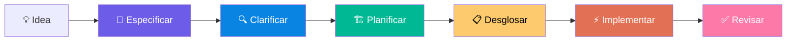

> 🌐 Leer en otros idiomas: [Español](README.es.md) | [English](README.md) | [Português](README.pt.md)

<p align="center">
  <h1 align="center">Don Cheli — SDD Framework</h1>
  <p align="center">
    <strong>Deja de adivinar. Empieza a hacer ingeniería.</strong><br/>
    <sub>El vibe coding es la chispa; SDD es el motor. Transiciona del caos asistido por IA a la entrega profesional de software.</sub>
  </p>
  <p align="center">
    El framework de Desarrollo Dirigido por Especificaciones más completo del mercado.<br/>
    Open source. Multilenguaje (ES/EN/PT). Para Claude Code y otros agentes IA.
  </p>
  <p align="center">
    <a href="#-instalación"></a>
    
    
    
    
    
    
    <br/>
    <a href="https://github.com/doncheli/don-cheli-sdd/actions/workflows/validar.yml"></a>
    <a href="https://codecov.io/gh/doncheli/don-cheli-sdd"></a>
    <a href="https://www.npmjs.com/package/don-cheli-sdd"></a>
    <a href="./CHANGELOG.md"></a>
    
    
  </p>
</p>

---

## Demo

```bash
# Sin Don Cheli:
"Claude, hazme una API de usuarios"
# → Código sin tests → roto en producción → "¿qué era lo que habíamos decidido ayer?"

# Con Don Cheli (un comando):
/dc:comenzar "API de usuarios con autenticación JWT"
# → Spec Gherkin → Tests primero → Código → Review → Listo con evidencia
```

> **¿Cómo se ve en acción?** Escribe `/dc:comenzar` y Don Cheli auto-detecta la complejidad,
> genera la especificación Gherkin, propone el blueprint técnico,
> desglosa en tareas TDD y ejecuta. Sin vibe coding. Con evidencia.

---

## El problema

Empiezas un proyecto con IA. Las primeras 2 horas todo va bien. Después:

- **Context rot** — Claude olvida tus decisiones de arquitectura
- **Stubs silenciosos** — Te dice "implementé el servicio" pero el código dice `// TODO`
- **Sin verificación** — ¿Funciona? No sé. ¿Tests? No. ¿Puedo deployar? Ojalá

Eso es **vibe coding**. Y es el enemigo del software de calidad.

---

## Antes vs Después

| Aspecto | ❌ Sin Don Cheli | ✅ Con Don Cheli |
|---------|-----------------|-----------------|
| **Requerimientos** | "Hazme un login" | Spec Gherkin con 8 escenarios verificables |
| **Arquitectura** | La IA inventa sobre la marcha | Blueprint técnico + DBML ratificado |
| **Tests** | "Quizás... algún día..." | TDD obligatorio: RED → GREEN → REFACTOR |
| **Calidad** | "Creo que funciona" | 6 Quality Gates + 85% cobertura |
| **Contexto** | Se pierde cada sesión | Persistencia total en archivos `.dc/` |
| **Stubs** | Pasan a producción | Detección automática de stubs fantasma |

---

## Instalación

**3 pasos. 2 minutos. Gratis.**

### Via npm (recomendado)

```bash
# 1. Instalar globalmente
npm install -g don-cheli-sdd

# 2. Ejecutar el instalador interactivo
don-cheli install --global

# 3. En tu proyecto, abre tu agente IA y escribe:
/dc:iniciar
```

### Via git clone

```bash
git clone https://github.com/doncheli/don-cheli-sdd.git
cd don-cheli-sdd && bash scripts/instalar.sh
```

<details>
<summary><strong>Via npx (sin instalar)</strong></summary>

```bash
npx don-cheli-sdd install --global --lang es
```

</details>

<details>
<summary><strong>Instalación remota (una sola línea)</strong></summary>

```bash
curl -fsSL https://raw.githubusercontent.com/doncheli/don-cheli-sdd/main/scripts/instalar.sh | bash -s -- --global --lang es
```

</details>

<details>
<summary><strong>Instalación silenciosa (CI/CD)</strong></summary>

```bash
bash scripts/instalar.sh \
  --tools claude,cursor \
  --profile phantom \
  --global --lang es
```

Flags: `--tools`, `--profile`, `--skills`, `--comandos`, `--dry-run`, `--global`, `--lang`

</details>

El instalador interactivo te guía paso a paso:

```
┌──────────────────────────────────────┐
│  Don Cheli SDD — Configuración       │
└──────────────────────────────────────┘

Paso 1: 🌍 Idioma      → Español, English, Português
Paso 2: 🔧 Herramienta → Claude Code, Cursor, Antigravity, Codex, Warp, Amp...
Paso 3: 👤 Perfil      → 6 arquetipos preconfigurados
Paso 4: ✅ Confirmar   → Resumen de todo lo seleccionado
```

**Requisitos:** Git + un agente IA (Claude Code, Cursor, etc.)

---

## Cómo funciona

**6 fases. De la idea al código verificado.**



| # | Fase | Comando | Qué hace |
|---|------|---------|----------|
| 1 | **Especificar** | `/dc:especificar` | Convierte tu idea en especificación Gherkin con escenarios de prueba, prioridades y schema DBML |
| 2 | **Clarificar** | `/dc:clarificar` | Un QA virtual detecta ambigüedades y contradicciones antes de codear |
| 3 | **Planificar** | `/dc:planificar-tecnico` | Blueprint técnico con arquitectura, contratos de API y schema final |
| 4 | **Desglosar** | `/dc:desglosar` | Divide el plan en tareas concretas con orden de ejecución y paralelismo |
| 5 | **Implementar** | `/dc:implementar` | Ejecuta con TDD estricto: primero el test, luego el código, luego mejora |
| 6 | **Revisar** | `/dc:revisar` | Peer review automático en 7 dimensiones: funcionalidad, tests, rendimiento, arquitectura, seguridad, mantenibilidad, docs |

Cada fase tiene **puertas de calidad**. No avanzas sin cumplir. **Sin atajos.**

---

## Se adapta a tu proyecto

No todo necesita las 6 fases. Don Cheli auto-detecta la complejidad:

| Nivel | Nombre | Cuándo | Fases |
|-------|--------|--------|-------|
| **0** | Atómico | 1 archivo, < 30 min | Implementar → Verificar |
| **P** | PoC | Validar viabilidad (2-4h) | Hipótesis → Construir → Evaluar → Veredicto |
| **1** | Micro | 1-3 archivos | Especificar (light) → Implementar → Revisar |
| **2** | Estándar | Múltiples archivos, 1-3 días | 6 fases completas |
| **3** | Complejo | Multi-módulo, 1-2 semanas | 6 fases + pseudocódigo |
| **4** | Producto | Sistema nuevo, 2+ semanas | 6 fases + constitución + propuesta |

```bash
/dc:comenzar Implementar autenticación JWT
# → ▶ Nivel detectado: 2 — Estándar
# → ▶ Fases: Especificar → Clarificar → Planificar → Desglosar → Implementar → Revisar
```

---

## Las 3 Leyes de Hierro

No negociables. Se aplican siempre. Sin excepciones.

| Ley | Principio | En la práctica |
|-----|-----------|----------------|
| **I. TDD** | Todo código requiere tests | `RED` → `GREEN` → `REFACTOR`, sin excepciones |
| **II. Debugging** | Causa raíz primero | Reproducir → Aislar → Entender → Corregir → Verificar |
| **III. Verificación** | Evidencia antes de afirmaciones | ✅ "Los tests pasan" > ❌ "Creo que funciona" |

---

## Por qué Don Cheli

<table>
<tr><th></th><th>BMAD<br/><sub>41K ⭐</sub></th><th>GSD<br/><sub>38K ⭐</sub></th><th>spec-kit<br/><sub>40K ⭐</sub></th><th><strong>Don Cheli</strong></th></tr>
<tr><td>Comandos</td><td>~20</td><td>~80</td><td>~10</td><td><strong>85+</strong></td></tr>
<tr><td>Habilidades (Skills)</td><td>~15</td><td>~15</td><td>~6</td><td><strong>42+</strong></td></tr>
<tr><td>Modelos de razonamiento</td><td>—</td><td>—</td><td>—</td><td><strong>15</strong></td></tr>
<tr><td>Estimados automáticos</td><td>—</td><td>—</td><td>—</td><td><strong>4 modelos</strong></td></tr>
<tr><td>Quality gates formales</td><td>—</td><td>1</td><td>4</td><td><strong>6</strong></td></tr>
<tr><td>TDD obligatorio</td><td>—</td><td>—</td><td>—</td><td><strong>Ley de Hierro</strong></td></tr>
<tr><td>Modo PoC</td><td>—</td><td>—</td><td>—</td><td><strong>✅</strong></td></tr>
<tr><td>Auditoría OWASP</td><td>—</td><td>—</td><td>—</td><td><strong>✅</strong></td></tr>
<tr><td>Migración de stacks</td><td>—</td><td>—</td><td>—</td><td><strong>✅</strong></td></tr>
<tr><td>Detección de stubs</td><td>—</td><td>✅</td><td>—</td><td><strong>✅</strong></td></tr>
<tr><td>Contratos UI/API</td><td>—</td><td>✅</td><td>—</td><td><strong>✅</strong></td></tr>
<tr><td>Multilenguaje (ES/EN/PT)</td><td>—</td><td>—</td><td>—</td><td><strong>✅</strong></td></tr>
<tr><td>Anthropic Skills 2.0</td><td>—</td><td>—</td><td>—</td><td><strong>✅</strong></td></tr>
<tr><td>Aislamiento Worktree</td><td>—</td><td>—</td><td>—</td><td><strong>✅</strong></td></tr>
<tr><td>Recuperación de crash</td><td>—</td><td>—</td><td>—</td><td><strong>✅</strong></td></tr>
<tr><td>Tracking de costos</td><td>—</td><td>—</td><td>—</td><td><strong>✅</strong></td></tr>
<tr><td>Detección de loops</td><td>—</td><td>—</td><td>—</td><td><strong>✅</strong></td></tr>
<tr><td>Skills Marketplace</td><td>—</td><td>—</td><td>—</td><td><strong>✅</strong></td></tr>
<tr><td>Debate adversarial multi-rol</td><td>—</td><td>—</td><td>—</td><td><strong>✅</strong></td></tr>
</table>

<details>
<summary><strong>20 cosas que solo Don Cheli tiene</strong></summary>

1. **15 modelos de razonamiento** — Pre-mortem, 5 porqués, Pareto, RLM
2. **4 modelos de estimación** — Puntos de Función, Planning Poker IA, COCOMO, Histórico
3. **Modo PoC** — Validar ideas con timebox y criterios de éxito antes de comprometer
4. **Blueprint Distillation** — Extraer specs desde código existente (ingeniería inversa)
5. **CodeRAG** — Indexar repos de referencia y recuperar patrones relevantes
6. **Auditoría OWASP** — Escaneo de seguridad estática integrado en el pipeline
7. **Migración de stacks** — Vue→React, JS→TS con plan de waves y equivalencias
8. **Contratos de API** — REST/GraphQL con reintentos, circuit breaker, idempotencia
9. **Refactorización SOLID** — Checklist, métricas, patrones de diseño estructurados
10. **Documentación viva** — ADRs, OpenAPI auto-generado, diagramas Mermaid
11. **Captures & Triage** — Anotar ideas sin pausar el trabajo, clasificación en 5 categorías
12. **UAT auto-generado** — Scripts de aceptación ejecutables por humano tras cada feature
13. **Doctor** — Diagnóstico y auto-reparación de git, framework y entorno
14. **Skill Creator** — Meta-skill iterativo para crear skills automáticamente
15. **Skills Marketplace** — Instalar skills desde Anthropic, comunidad, o crear las tuyas
16. **Constitución de proyecto** — 8 principios inmutables validados en cada puerta de calidad
17. **Pseudocódigo formal (SPARC)** — Razonamiento lógico agnóstico de tecnología
18. **Validación multi-capa** — 8 checks (leakage, medibilidad, completitud, constitución)
19. **Debate adversarial** — PM vs Arquitecto vs QA con objeción obligatoria
20. **Scale-adaptive planning** — Proceso se ajusta según complejidad (N0 a N4)

</details>

---

## Perfiles

6 arquetipos preconfigurados. Cada uno con skills, comandos y modelos de razonamiento optimizados:

| Perfil | Rol | Para qué | Razonamiento |
|--------|-----|----------|--------------|
| 👻 **Phantom Coder** | Full-stack | Pipeline completo, TDD, quality gates, deploy | Primeros Principios, Pre-mortem, 5 Porqués |
| 💀 **Reaper Sec** | Seguridad | OWASP, auditoría, pentest, seguridad ofensiva/defensiva | Pre-mortem, Inversión, Primeros Principios |
| 🏗 **System Architect** | Arquitectura | Blueprints, SOLID, APIs, migraciones, diseño de sistemas | Primeros Principios, Segundo Orden, Mapa-Territorio |
| ⚡ **Speedrunner** | MVP/Startup | PoC rápidas, estimados ágiles, lanzar primero | Pre-mortem, Pareto, Costo de Oportunidad |
| 🔮 **The Oracle** | Razonamiento | 15 modelos mentales, análisis profundo, decisiones difíciles | Los 15 modelos completos |
| 🥷 **Dev Dojo** | Aprendizaje | Documentación viva, ADRs, reflexiones, crecer mientras construyes | Primeros Principios, 5 Porqués, Segundo Orden |

---

## Comandos (85+)

Top 20 más usados. [Lista completa en la documentación web →](https://doncheli.tv/comousar.html)

### Pipeline principal

| Comando | Qué hace |
|---------|----------|
| `/dc:comenzar` | Inicia tarea detectando complejidad (Nivel 0-4) |
| `/dc:especificar` | Convierte tu idea en spec Gherkin con escenarios |
| `/dc:clarificar` | Encuentra ambigüedades y las resuelve antes de codear |
| `/dc:planificar-tecnico` | Genera blueprint técnico con arquitectura y contratos |
| `/dc:desglosar` | Divide el plan en tareas concretas con orden de ejecución |
| `/dc:implementar` | Ejecuta las tareas con TDD: RED → GREEN → REFACTOR |
| `/dc:revisar` | Peer review automático en 7 dimensiones |

### Análisis y decisiones

| Comando | Qué hace |
|---------|----------|
| `/dc:explorar` | Explora el codebase antes de proponer cambios |
| `/dc:estimar` | Estimados con 4 modelos (Function Points, COCOMO, Planning Poker, Histórico) |
| `/dc:mesa-redonda` | Discusión multi-perspectiva: CPO, UX, Negocio |
| `/dc:mesa-tecnica` | Panel de expertos: Tech Lead, Backend, Frontend, Arquitecto |
| `/dc:auditar-seguridad` | Auditoría OWASP Top 10 estática |
| `/dc:poc` | Prueba de Concepto con timebox y criterios claros |

### Sesión y contexto

| Comando | Qué hace |
|---------|----------|
| `/dc:continuar` | Recupera tu sesión previa sin perder contexto |
| `/dc:estado` | Muestra el estado actual del proyecto |
| `/dc:doctor` | Diagnostica y repara problemas del framework |
| `/dc:capturar` | Captura ideas sin interrumpir tu flujo |
| `/dc:migrar` | Planifica migración entre stacks (Vue→React, JS→TS...) |
| `/dc:actualizar` | Actualiza Don Cheli a la última versión |

<details>
<summary><strong>Modelos de razonamiento (15)</strong></summary>

| Comando | Qué hace |
|---------|----------|
| `/razonar:primeros-principios` | Descomponer a verdades fundamentales |
| `/razonar:5-porques` | Causa raíz iterativa |
| `/razonar:pareto` | Enfoque 80/20 |
| `/razonar:inversion` | Resolver al revés: ¿cómo garantizo el fracaso? |
| `/razonar:segundo-orden` | Consecuencias de las consecuencias |
| `/razonar:pre-mortem` | Anticipar fracasos antes de que ocurran |
| `/razonar:minimizar-arrepentimiento` | Framework de Jeff Bezos |
| `/razonar:costo-oportunidad` | Evaluar alternativas sacrificadas |
| `/razonar:circulo-competencia` | Conocer los límites del conocimiento |
| `/razonar:mapa-territorio` | Modelo vs realidad |
| `/razonar:probabilistico` | Razonar en probabilidades, no certezas |
| `/razonar:reversibilidad` | ¿Se puede deshacer esta decisión? |
| `/razonar:rlm-verificacion` | Verificación con sub-LLMs frescos |
| `/razonar:rlm-cadena-pensamiento` | Context Folding multi-paso |
| `/razonar:rlm-descomposicion` | Divide y conquista con subagentes |

</details>

> **📖 ¿Quieres ver todos los comandos en acción con ejemplos interactivos?**
> Visita la guía completa: **[doncheli.tv/comousar.html](https://doncheli.tv/comousar.html)**

---

## Multi-plataforma

Don Cheli no es un programa. Son archivos Markdown que cualquier agente de IA puede interpretar.

| Plataforma | Soporte | Archivo de instrucciones |
|-----------|---------|--------------------------|
| **Claude Code** | Nativo completo | `CLAUDE.md` |
| **Google Antigravity** | Nativo con 5 skills + 4 workflows | `GEMINI.md` |
| **Cursor** | Via contrato universal | `AGENTS.md` |
| **Codex** | Via contrato universal | `AGENTS.md` |
| **Warp** | Compatible | `CLAUDE.md` |
| **Amp** | Compatible | `prompt.md` |
| **Continue.dev** | Compatible | `AGENTS.md` |
| **OpenCode** | Compatible | `AGENTS.md` |

---

## Certificación SDD

Demuestra que tu proyecto fue construido con disciplina de ingeniería. Agrega estos badges a tu README:

```markdown
[](https://github.com/doncheli/don-cheli-sdd)
[](https://github.com/doncheli/don-cheli-sdd)
[](https://github.com/doncheli/don-cheli-sdd)
```

[](https://github.com/doncheli/don-cheli-sdd) [](https://github.com/doncheli/don-cheli-sdd) [](https://github.com/doncheli/don-cheli-sdd)

[Criterios completos de certificación →](docs/certification.md)

---

## Filosofía

> **"Ventana de Contexto = RAM, Sistema de Archivos = Disco"**

1. **Persistencia sobre conversación** — Escríbelo, no solo dígalo
2. **Estructura sobre caos** — Archivos claros, roles claros
3. **Recuperación sobre reinicio** — Nunca perder progreso
4. **Evidencia sobre afirmaciones** — Muestra, no cuentes
5. **Simplicidad sobre complejidad** — Todo en tu idioma

---

## Comunidad y soporte

- [GitHub Discussions](https://github.com/doncheli/don-cheli-sdd/discussions) — Preguntas y propuestas
- [GitHub Issues](https://github.com/doncheli/don-cheli-sdd/issues) — Bugs y feature requests
- [YouTube @doncheli](https://youtube.com/@doncheli) — Tutoriales y demos
- [Instagram @doncheli.tv](https://instagram.com/doncheli.tv) — Novedades
- [doncheli.tv](https://doncheli.tv) — Documentación web completa

---

## Contribuir

Ver [CONTRIBUIR.md](CONTRIBUIR.md) para la guía completa.

---

## Licencia

[Apache 2.0](LICENCIA) — Copyright 2026 Jose Luis Oronoz Troconis (@DonCheli)

---

<p align="center">
  <strong>Deja de adivinar. Empieza a hacer ingeniería.</strong><br/><br/>
  <a href="https://doncheli.tv/comousar.html"></a>
  <a href="https://github.com/doncheli/don-cheli-sdd"></a>
  <br/><br/>
  <sub>Hecho con ❤️ en Latinoamérica — Don Cheli SDD Framework</sub>
</p>
