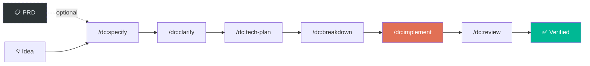

> 🌐 Read in: [English](README.md) | [Español](README.es.md) | [Português](README.pt.md)

<p align="center">
  <h1 align="center">Don Cheli — SDD Framework</h1>
  <p align="center">
    <strong>Stop guessing. Start engineering.</strong><br/>
    <sub>The only framework where TDD is law, not a suggestion.</sub>
  </p>
  <p align="center">
    <a href="#install"></a>
    
    
    
    
    <a href="https://marketplace.visualstudio.com/items?itemName=doncheli.don-cheli-sdd"></a>
    <br/>
    <a href="https://github.com/doncheli/don-cheli-sdd/actions/workflows/validar.yml"></a>
    <a href="https://codecov.io/gh/doncheli/don-cheli-sdd"></a>
  </p>
</p>

---

## One command. Verified code.

```bash
/dc:auto "Implement JWT authentication with refresh tokens"
```

Don Cheli takes your idea and delivers **tested, reviewed, verified code** — automatically.

```
  ✅ /dc:specify             8 Gherkin scenarios generated
  ✅ /dc:clarify             2 ambiguities resolved
  ✅ /dc:tech-plan           Blueprint: 3-layer architecture
  ✅ /dc:breakdown           7 TDD tasks created
  ✅ /dc:implement           14 tests pass, 91% coverage
  ✅ /dc:review              7/7 review dimensions passed

  Result: ALL PASSED — Project updated with verified code
```

Your project is **untouched** until everything passes. If anything fails, nothing changes.

---

## Install

```bash
npm install -g don-cheli-sdd
don-cheli install --global
```

<details>
<summary>Other install methods</summary>

```bash
# Git clone
git clone https://github.com/doncheli/don-cheli-sdd.git
cd don-cheli-sdd && bash scripts/instalar.sh

# One liner
curl -fsSL https://raw.githubusercontent.com/doncheli/don-cheli-sdd/main/scripts/instalar.sh | bash -s -- --global --lang en

# VS Code Extension
code --install-extension doncheli.don-cheli-sdd
```

</details>

---

## How it works



| Phase | Command | What happens |
|-------|---------|-------------|
| Specify | `/dc:specify` | Your idea → Gherkin specs with test scenarios |
| Clarify | `/dc:clarify` | QA finds ambiguities before you code |
| Plan | `/dc:tech-plan` | Architecture + API contracts + schema |
| Break Down | `/dc:breakdown` | TDD tasks with parallelism markers |
| Implement | `/dc:implement` | Test FIRST → code → refactor (Iron Law) |
| Review | `/dc:review` | 7-dimension peer review |

**Each phase has a quality gate.** You don't advance without passing. No shortcuts.

---

## 3 ways to use it

```bash
# Interactive — you drive each phase
/dc:start "JWT auth"

# Autonomous — runtime drives everything, Docker isolates
/dc:auto "JWT auth"

# Terminal — without AI agent open
don-cheli auto "JWT auth"
```

---

## The Iron Laws

These are **not suggestions**. The runtime **enforces** them.

| Law | Rule | Enforcement |
|-----|------|-------------|
| **TDD** | No code without tests | Blocks merge if tests don't exist |
| **No Stubs** | No `// TODO` in production | Scans and rejects |
| **Evidence** | Proof, not promises | Coverage >= 85% verified |

---

## Why Don Cheli

93 commands · 51 skills · 15 reasoning models · 9 IDEs · 3 languages

The only SDD framework with **all** of these:

- ✅ TDD as unbreakable law (not optional)
- ✅ Autonomous mode with Docker isolation
- ✅ OWASP security audit in the pipeline
- ✅ 15 reasoning models (Pre-mortem, 5 Whys, Pareto, RLM...)
- ✅ PRD Generator (reads Figma designs)
- ✅ Pre-flight cost simulation
- ✅ Crash recovery (resume where you left off)
- ✅ Custom quality gates (YAML plugins)
- ✅ Drift detection (spec vs code watcher)
- ✅ SDD Certification badges
- ✅ Works with Claude, Cursor, Gemini, Codex, OpenCode, Qwen, Amp, Windsurf
- ✅ ES / EN / PT

[Full feature comparison →](https://doncheli.tv/comousar.html)

---

## Platforms

| Platform | Install | Details |
|----------|---------|---------|
| **Claude Code** | `--tools claude` | 93 `/dc:*` commands (full native) |
| **OpenCode** | `--tools opencode` | 28 `/doncheli-*` slash commands + 28 skills |
| **Antigravity** | `--tools antigravity` | `GEMINI.md` + `.agent/skills/` |
| **Cursor** | `--tools cursor` | `.cursorrules` |
| **Codex / Qwen** | `--tools codex` | `AGENTS.md` |

[IDE setup details →](https://doncheli.tv/comousar.html)

---

## Community

- [GitHub](https://github.com/doncheli/don-cheli-sdd) · [npm](https://www.npmjs.com/package/don-cheli-sdd) · [VS Code](https://marketplace.visualstudio.com/items?itemName=doncheli.don-cheli-sdd)
- [Full Documentation](https://doncheli.tv/comousar.html) · [YouTube](https://youtube.com/@doncheli) · [Instagram](https://instagram.com/doncheli.tv)

---

## License

[Apache 2.0](LICENSE) — Copyright 2026 Jose Luis Oronoz Troconis ([@DonCheli](https://github.com/doncheli))

---

<p align="center">
  <a href="https://doncheli.tv/comousar.html"></a>
  <a href="https://github.com/doncheli/don-cheli-sdd"></a>
  <br/><br/>
  <sub>Made with ❤️ in Latin America — Don Cheli SDD Framework</sub>
</p>
