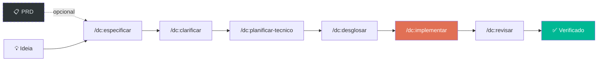

> 🌐 Leia em: [English](README.md) | [Español](README.es.md) | [Português](README.pt.md)

<p align="center">
  <h1 align="center">Don Cheli — SDD Framework</h1>
  <p align="center">
    <strong>Pare de adivinhar. Comece a fazer engenharia.</strong><br/>
    <sub>O único framework onde TDD é lei, não uma sugestão.</sub>
  </p>
  <p align="center">
    <a href="#instalação"></a>
    
    
    
    
    <a href="https://marketplace.visualstudio.com/items?itemName=doncheli.don-cheli-sdd"></a>
    <br/>
    <a href="https://github.com/doncheli/don-cheli-sdd/actions/workflows/validar.yml"></a>
    <a href="https://codecov.io/gh/doncheli/don-cheli-sdd"></a>
  </p>
</p>

---

## Um comando. Código verificado.

```bash
/dc:auto "Implementar autenticação JWT com refresh tokens"
```

Don Cheli pega sua ideia e entrega **código testado, revisado e verificado** — automaticamente.

```
  ✅ /dc:especificar         8 cenários Gherkin gerados
  ✅ /dc:clarificar          2 ambiguidades resolvidas
  ✅ /dc:planificar-tecnico  Blueprint: arquitetura 3 camadas
  ✅ /dc:desglosar           7 tarefas TDD criadas
  ✅ /dc:implementar         14 testes passam, 91% cobertura
  ✅ /dc:revisar             7/7 dimensões de review aprovadas

  Resultado: TUDO PASSOU — Projeto atualizado com código verificado
```

Seu projeto fica **intacto** até que tudo passe. Se algo falhar, nada muda.

### Impulsionado por um orquestrador TypeScript real

Não são apenas prompts — é um **runtime real** que força cada regra:

```
Orquestrador (TypeScript)
  ├── Cria git worktree (seu projeto fica seguro)
  ├── Levanta container Docker (execução isolada)
  ├── Executa /dc:especificar → /dc:revisar (comandos reais)
  ├── Quality gates verificam DEPOIS de cada fase:
  │   ├── Spec gate: existem arquivos .feature?
  │   ├── TDD gate: testes existem? passam? sem stubs?
  │   ├── Coverage gate: >= 85%?
  │   └── Custom gates: .dc/gates/*.yml
  ├── TUDO PASSA → merge no projeto ✅
  └── ALGO FALHA → descarta worktree, projeto INTACTO ❌
```

**3 providers:** Claude Code (assinatura) · OpenAI Codex · Ollama (grátis, modelos locais)

---

## Instalação

```bash
npm install -g don-cheli-sdd
don-cheli install --global
```

<details>
<summary>Outros métodos de instalação</summary>

```bash
# Git clone
git clone https://github.com/doncheli/don-cheli-sdd.git
cd don-cheli-sdd && bash scripts/instalar.sh

# Uma linha
curl -fsSL https://raw.githubusercontent.com/doncheli/don-cheli-sdd/main/scripts/instalar.sh | bash -s -- --global --lang pt

# Extensão VS Code
code --install-extension doncheli.don-cheli-sdd
```

</details>

---

## Como funciona



| Fase | Comando | O que faz |
|------|---------|-----------|
| Especificar | `/dc:especificar` | Sua ideia → specs Gherkin com cenários de teste |
| Clarificar | `/dc:clarificar` | QA detecta ambiguidades antes de codificar |
| Planejar | `/dc:planificar-tecnico` | Arquitetura + contratos API + schema |
| Desdobrar | `/dc:desglosar` | Tarefas TDD com marcadores de paralelismo |
| Implementar | `/dc:implementar` | Teste PRIMEIRO → código → refatorar (Lei de Ferro) |
| Revisar | `/dc:revisar` | Peer review em 7 dimensões |

**Cada fase tem uma porta de qualidade.** Não avança sem passar. Sem atalhos.

---

## 3 formas de usar

```bash
# Interativo — você dirige cada fase
/dc:começar "JWT auth"

# Autônomo — runtime dirige tudo, Docker isola
/dc:auto "JWT auth"

# Terminal — sem agente IA aberto
don-cheli auto "JWT auth"
```

---

## As Leis de Ferro

Não são sugestões. O runtime as **força**.

| Lei | Regra | Como é forçada |
|-----|-------|----------------|
| **TDD** | Sem testes não há código | Bloqueia merge se testes não existem |
| **Sem Stubs** | No `// TODO` em produção | Varre e rejeita |
| **Evidência** | Provas, não promessas | Cobertura >= 85% verificada |

---

## Por que Don Cheli

93 comandos · 51 habilidades · 15 modelos de raciocínio · 9 IDEs · 3 idiomas

O único framework SDD com **tudo** isto:

- ✅ TDD como lei inquebrantável (não opcional)
- ✅ Modo autônomo com isolamento Docker
- ✅ Auditoria OWASP no pipeline
- ✅ 15 modelos de raciocínio (Pre-mortem, 5 Porquês, Pareto, RLM...)
- ✅ Gerador de PRD (lê designs do Figma)
- ✅ Simulação pre-flight de custos
- ✅ Crash recovery (retoma de onde parou)
- ✅ Quality gates custom (plugins YAML)
- ✅ Detecção de drift (spec vs código)
- ✅ Badges de Certificação SDD
- ✅ Compatível com Claude, Cursor, Gemini, Codex, OpenCode, Qwen, Amp, Windsurf
- ✅ ES / EN / PT

[Comparação completa →](https://doncheli.tv/comousar.html)

---

## Plataformas

| Plataforma | Instalar | Detalhe |
|-----------|----------|---------|
| **Claude Code** | `--tools claude` | 93 comandos `/dc:*` (nativo completo) |
| **OpenCode** | `--tools opencode` | 28 `/doncheli-*` slash commands + 28 skills |
| **Antigravity** | `--tools antigravity` | `GEMINI.md` + `.agent/skills/` |
| **Cursor** | `--tools cursor` | `.cursorrules` |
| **Codex / Qwen** | `--tools codex` | `AGENTS.md` |

[Detalhe por IDE →](https://doncheli.tv/comousar.html)

---

## Comunidade

- [GitHub](https://github.com/doncheli/don-cheli-sdd) · [npm](https://www.npmjs.com/package/don-cheli-sdd) · [VS Code](https://marketplace.visualstudio.com/items?itemName=doncheli.don-cheli-sdd)
- [Documentação completa](https://doncheli.tv/comousar.html) · [YouTube](https://youtube.com/@doncheli) · [Instagram](https://instagram.com/doncheli.tv)

---

## Licença

[Apache 2.0](LICENCIA) — Copyright 2026 Jose Luis Oronoz Troconis ([@DonCheli](https://github.com/doncheli))

---

<p align="center">
  <a href="https://doncheli.tv/comousar.html"></a>
  <a href="https://github.com/doncheli/don-cheli-sdd"></a>
  <br/><br/>
  <sub>Feito com ❤️ na América Latina — Don Cheli SDD Framework</sub>
</p>
