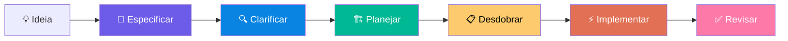

> 🌐 Leia em outros idiomas: [Español](README.es.md) | [English](README.md) | [Português](README.pt.md)

<p align="center">
  <h1 align="center">Don Cheli — SDD Framework</h1>
  <p align="center">
    <strong>Pare de adivinhar. Comece a fazer engenharia.</strong><br/>
    <sub>Vibe coding é a faísca; SDD é o motor. Transite do caos assistido por IA para a entrega profissional de software.</sub>
  </p>
  <p align="center">
    O framework de Desenvolvimento Dirigido por Especificações mais completo do mercado.<br/>
    Open source. Multilíngue (ES/EN/PT). Para Claude Code e outros agentes IA.
  </p>
  <p align="center">
    <a href="#-instalação"></a>
    
    
    
    
    
    
    <br/>
    <a href="https://github.com/doncheli/don-cheli-sdd/actions/workflows/validar.yml"></a>
    <a href="https://codecov.io/gh/doncheli/don-cheli-sdd"></a>
    <a href="https://www.npmjs.com/package/don-cheli-sdd"></a>
    <a href="./CHANGELOG.md"></a>
    
    
  </p>
</p>

---

## Demo

```bash
# Sem Don Cheli:
"Claude, crie uma API de usuários"
# → Código sem testes → quebrado em produção → "O que decidimos ontem?"

# Com Don Cheli (um comando):
/dc:começar "API de usuários com autenticação JWT"
# → Spec Gherkin → Testes primeiro → Código → Review → Pronto com evidência
```

> **Como se vê em ação?** Digite `/dc:começar` e Don Cheli auto-detecta a complexidade,
> gera a especificação Gherkin, propõe o blueprint técnico,
> desdobra em tarefas TDD e executa. Sem vibe coding. Com evidência.

---

## O Problema

Você começa um projeto com IA. As primeiras 2 horas vão bem. Depois:

- **Context rot** — Claude esquece suas decisões de arquitetura
- **Stubs silenciosos** — Diz "implementei o serviço" mas o código diz `// TODO`
- **Sem verificação** — Funciona? Não sei. Testes? Não. Posso deployar? Tomara

Isso é **vibe coding**. E é o inimigo do software de qualidade.

---

## Antes vs Depois

| Aspecto | ❌ Sem Don Cheli | ✅ Com Don Cheli |
|---------|-----------------|-----------------|
| **Requisitos** | "Me faça um login" | Spec Gherkin com 8 cenários verificáveis |
| **Arquitetura** | A IA inventa na hora | Blueprint técnico + DBML ratificado |
| **Testes** | "Talvez... um dia..." | TDD obrigatório: RED → GREEN → REFACTOR |
| **Qualidade** | "Acho que funciona" | 6 Quality Gates + 85% cobertura |
| **Contexto** | Perde-se a cada sessão | Persistência total em arquivos `.dc/` |
| **Stubs** | Vão para produção | Detecção automática de stubs fantasma |

---

## Instalação

**3 passos. 2 minutos. Grátis.**

### Via npm (recomendado)

```bash
# 1. Instalar globalmente
npm install -g don-cheli-sdd

# 2. Executar o instalador interativo
don-cheli install --global

# 3. No seu projeto, abra seu agente IA e digite:
/dc:iniciar
```

### Extensao VS Code

Busque **"Don Cheli SDD"** no VS Code Extensions, ou:

```bash
code --install-extension doncheli.don-cheli-sdd
```

Inclui: sidebar com status do projeto, quality gates, explorador de comandos e dashboard de metricas.

### Via git clone

```bash
git clone https://github.com/doncheli/don-cheli-sdd.git
cd don-cheli-sdd && bash scripts/instalar.sh
```

<details>
<summary><strong>Via npx (sem instalar)</strong></summary>

```bash
npx don-cheli-sdd install --global --lang pt
```

</details>

<details>
<summary><strong>Instalação remota (uma linha)</strong></summary>

```bash
curl -fsSL https://raw.githubusercontent.com/doncheli/don-cheli-sdd/main/scripts/instalar.sh | bash -s -- --global --lang pt
```

</details>

<details>
<summary><strong>Instalação silenciosa (CI/CD)</strong></summary>

```bash
bash scripts/instalar.sh \
  --tools claude,cursor \
  --profile phantom \
  --global --lang pt
```

Flags: `--tools`, `--profile`, `--skills`, `--comandos`, `--dry-run`, `--global`, `--lang`

</details>

O instalador interativo guia você passo a passo:

```
┌──────────────────────────────────────┐
│  Don Cheli SDD — Configuração        │
└──────────────────────────────────────┘

Passo 1: 🌍 Idioma     → Español, English, Português
Passo 2: 🔧 Ferramenta → Claude Code, Cursor, Antigravity, Codex, Warp, Amp...
Passo 3: 👤 Perfil     → 6 arquétipos pré-configurados
Passo 4: ✅ Confirmar  → Resumo de tudo selecionado
```

**Requisitos:** Git + um agente IA (Claude Code, Cursor, etc.)

---

## Como Funciona

**6 fases. Da ideia ao código verificado.**



| # | Fase | Comando | O que faz |
|---|------|---------|-----------|
| 1 | **Especificar** | `/dc:especificar` | Transforma sua ideia em especificação Gherkin com cenários de teste, prioridades e schema DBML |
| 2 | **Clarificar** | `/dc:clarificar` | Um QA virtual detecta ambiguidades e contradições antes de codificar |
| 3 | **Planejar** | `/dc:planificar-tecnico` | Blueprint técnico com arquitetura, contratos de API e schema final |
| 4 | **Desdobrar** | `/dc:desglosar` | Divide o plano em tarefas concretas com ordem de execução e paralelismo |
| 5 | **Implementar** | `/dc:implementar` | Executa com TDD estrito: primeiro o teste, depois o código, depois melhora |
| 6 | **Revisar** | `/dc:revisar` | Peer review automático em 7 dimensões: funcionalidade, testes, desempenho, arquitetura, segurança, manutenibilidade, docs |

Cada fase tem **portas de qualidade**. Não avança sem passar. **Sem atalhos.**

---

## Adapta-se ao Seu Projeto

Nem tudo precisa das 6 fases. Don Cheli auto-detecta a complexidade:

| Nível | Nome | Quando | Fases |
|-------|------|--------|-------|
| **0** | Atômico | 1 arquivo, < 30 min | Implementar → Verificar |
| **P** | PoC | Validar viabilidade (2-4h) | Hipótese → Construir → Avaliar → Veredicto |
| **1** | Micro | 1-3 arquivos | Especificar (light) → Implementar → Revisar |
| **2** | Padrão | Múltiplos arquivos, 1-3 dias | 6 fases completas |
| **3** | Complexo | Multi-módulo, 1-2 semanas | 6 fases + pseudocódigo |
| **4** | Produto | Sistema novo, 2+ semanas | 6 fases + constituição + proposta |

```bash
/dc:começar Implementar autenticação JWT
# → ▶ Nível detectado: 2 — Padrão
# → ▶ Fases: Especificar → Clarificar → Planejar → Desdobrar → Implementar → Revisar
```

---

## As 3 Leis de Ferro

Não negociáveis. Sempre aplicadas. Sem exceções.

| Lei | Princípio | Na prática |
|-----|-----------|------------|
| **I. TDD** | Todo código requer testes | `RED` → `GREEN` → `REFACTOR`, sem exceções |
| **II. Debugging** | Causa raiz primeiro | Reproduzir → Isolar → Entender → Corrigir → Verificar |
| **III. Verificação** | Evidência antes de afirmações | ✅ "Os testes passam" > ❌ "Acho que funciona" |

---

## Por que Don Cheli

<table>
<tr><th></th><th>BMAD<br/><sub>41K ⭐</sub></th><th>GSD<br/><sub>38K ⭐</sub></th><th>spec-kit<br/><sub>40K ⭐</sub></th><th><strong>Don Cheli</strong></th></tr>
<tr><td>Comandos</td><td>~20</td><td>~80</td><td>~10</td><td><strong>85+</strong></td></tr>
<tr><td>Habilidades (Skills)</td><td>~15</td><td>~15</td><td>~6</td><td><strong>42+</strong></td></tr>
<tr><td>Modelos de raciocínio</td><td>—</td><td>—</td><td>—</td><td><strong>15</strong></td></tr>
<tr><td>Estimativas automáticas</td><td>—</td><td>—</td><td>—</td><td><strong>4 modelos</strong></td></tr>
<tr><td>Quality gates formais</td><td>—</td><td>1</td><td>4</td><td><strong>6</strong></td></tr>
<tr><td>TDD obrigatório</td><td>—</td><td>—</td><td>—</td><td><strong>Lei de Ferro</strong></td></tr>
<tr><td>Modo PoC</td><td>—</td><td>—</td><td>—</td><td><strong>✅</strong></td></tr>
<tr><td>Auditoria OWASP</td><td>—</td><td>—</td><td>—</td><td><strong>✅</strong></td></tr>
<tr><td>Migração de stacks</td><td>—</td><td>—</td><td>—</td><td><strong>✅</strong></td></tr>
<tr><td>Detecção de stubs</td><td>—</td><td>✅</td><td>—</td><td><strong>✅</strong></td></tr>
<tr><td>Contratos UI/API</td><td>—</td><td>✅</td><td>—</td><td><strong>✅</strong></td></tr>
<tr><td>Multilíngue (ES/EN/PT)</td><td>—</td><td>—</td><td>—</td><td><strong>✅</strong></td></tr>
<tr><td>Anthropic Skills 2.0</td><td>—</td><td>—</td><td>—</td><td><strong>✅</strong></td></tr>
<tr><td>Isolamento Worktree</td><td>—</td><td>—</td><td>—</td><td><strong>✅</strong></td></tr>
<tr><td>Recuperação de crash</td><td>—</td><td>—</td><td>—</td><td><strong>✅</strong></td></tr>
<tr><td>Rastreio de custos</td><td>—</td><td>—</td><td>—</td><td><strong>✅</strong></td></tr>
<tr><td>Detecção de loops</td><td>—</td><td>—</td><td>—</td><td><strong>✅</strong></td></tr>
<tr><td>Skills Marketplace</td><td>—</td><td>—</td><td>—</td><td><strong>✅</strong></td></tr>
<tr><td>Debate adversarial multi-papel</td><td>—</td><td>—</td><td>—</td><td><strong>✅</strong></td></tr>
<tr><td>CI/CD GitHub Action</td><td>—</td><td>—</td><td>—</td><td><strong>✅</strong></td></tr>
<tr><td>Custom Quality Gates (plugins)</td><td>—</td><td>—</td><td>—</td><td><strong>✅</strong></td></tr>
<tr><td>Dashboard de telemetria</td><td>—</td><td>—</td><td>—</td><td><strong>✅</strong></td></tr>
<tr><td>Extensao VS Code</td><td>—</td><td>—</td><td>—</td><td><strong>✅</strong></td></tr>
<tr><td>Drift Detection (vigilante async)</td><td>—</td><td>—</td><td>—</td><td><strong>✅</strong></td></tr>
<tr><td>Time Travel do Raciocinio</td><td>—</td><td>—</td><td>—</td><td><strong>✅</strong></td></tr>
<tr><td>Simulacao Pre-Flight de Custos</td><td>—</td><td>—</td><td>—</td><td><strong>✅</strong></td></tr>
</table>

<details>
<summary><strong>20 coisas que só Don Cheli tem</strong></summary>

1. **15 modelos de raciocínio** — Pre-mortem, 5 Porquês, Pareto, RLM
2. **4 modelos de estimativa** — Pontos de Função, Planning Poker IA, COCOMO, Histórico
3. **Modo PoC** — Validar ideias com timebox e critérios de sucesso antes de comprometer
4. **Blueprint Distillation** — Extrair specs de código existente (engenharia reversa)
5. **CodeRAG** — Indexar repos de referência e recuperar padrões relevantes
6. **Auditoria OWASP** — Varredura de segurança estática integrada no pipeline
7. **Migração de stacks** — Vue→React, JS→TS com plano de ondas e equivalências
8. **Contratos de API** — REST/GraphQL com retentativas, circuit breaker, idempotência
9. **Refatoração SOLID** — Checklist, métricas, padrões de design estruturados
10. **Documentação viva** — ADRs, OpenAPI auto-gerado, diagramas Mermaid
11. **Capturas & Triagem** — Anotar ideias sem parar, classificação em 5 categorias
12. **UAT auto-gerado** — Scripts de aceitação executáveis por humano após cada feature
13. **Doctor** — Diagnóstico e auto-reparo de git, framework e ambiente
14. **Skill Creator** — Meta-skill iterativo para criar skills automaticamente
15. **Skills Marketplace** — Instalar skills da Anthropic, comunidade, ou criar as suas
16. **Constituição de projeto** — 8 princípios imutáveis validados em cada porta de qualidade
17. **Pseudocódigo formal (SPARC)** — Raciocínio lógico agnóstico de tecnologia
18. **Validação multi-camada** — 8 verificações (vazamento, mensurabilidade, completude, constituição)
19. **Debate adversarial** — PM vs Arquiteto vs QA com objeção obrigatória
20. **Planejamento adaptável** — Processo se ajusta por complexidade (N0 a N4)

</details>

---

## Perfis

6 arquétipos pré-configurados. Cada um com skills, comandos e modelos de raciocínio otimizados:

| Perfil | Papel | Para quê | Raciocínio |
|--------|-------|----------|------------|
| 👻 **Phantom Coder** | Full-stack | Pipeline completo, TDD, quality gates, deploy | Primeiros Princípios, Pre-mortem, 5 Porquês |
| 💀 **Reaper Sec** | Segurança | OWASP, auditoria, pentest, segurança ofensiva/defensiva | Pre-mortem, Inversão, Primeiros Princípios |
| 🏗 **System Architect** | Arquitetura | Blueprints, SOLID, APIs, migrações, design de sistemas | Primeiros Princípios, Segunda Ordem, Mapa-Território |
| ⚡ **Speedrunner** | MVP/Startup | PoC rápidas, estimativas ágeis, lançar primeiro | Pre-mortem, Pareto, Custo de Oportunidade |
| 🔮 **The Oracle** | Raciocínio | 15 modelos mentais, análise profunda, decisões difíceis | Os 15 modelos completos |
| 🥷 **Dev Dojo** | Aprendizado | Docs vivos, ADRs, reflexões, crescer enquanto constrói | Primeiros Princípios, 5 Porquês, Segunda Ordem |

---

## Comandos (85+)

Top 20 mais usados. [Lista completa na documentação web →](https://doncheli.tv/comousar.html)

### Pipeline principal

| Comando | O que faz |
|---------|-----------|
| `/dc:começar` | Inicia tarefa detectando complexidade (Nível 0-4) |
| `/dc:especificar` | Transforma sua ideia em spec Gherkin com cenários |
| `/dc:clarificar` | Encontra ambiguidades e resolve antes de codificar |
| `/dc:planificar-tecnico` | Gera blueprint técnico com arquitetura e contratos |
| `/dc:desglosar` | Divide o plano em tarefas concretas com ordem de execução |
| `/dc:implementar` | Executa as tarefas com TDD: RED → GREEN → REFACTOR |
| `/dc:revisar` | Peer review automático em 7 dimensões |

### Análise e decisões

| Comando | O que faz |
|---------|-----------|
| `/dc:explorar` | Explora o codebase antes de propor mudanças |
| `/dc:estimar` | Estimativas com 4 modelos (Function Points, COCOMO, Planning Poker, Histórico) |
| `/dc:mesa-redonda` | Discussão multi-perspectiva: CPO, UX, Negócio |
| `/dc:mesa-tecnica` | Painel de especialistas: Tech Lead, Backend, Frontend, Arquiteto |
| `/dc:auditar-seguridad` | Auditoria OWASP Top 10 estática |
| `/dc:poc` | Prova de Conceito com timebox e critérios claros |

### Sessão e contexto

| Comando | O que faz |
|---------|-----------|
| `/dc:continuar` | Recupera sua sessão anterior sem perder contexto |
| `/dc:estado` | Mostra o estado atual do projeto |
| `/dc:doctor` | Diagnostica e repara problemas do framework |
| `/dc:capturar` | Captura ideias sem interromper seu fluxo |
| `/dc:migrar` | Planeja migração entre stacks (Vue→React, JS→TS...) |
| `/dc:actualizar` | Atualiza Don Cheli para a última versão |

<details>
<summary><strong>Modelos de raciocínio (15)</strong></summary>

| Comando | O que faz |
|---------|-----------|
| `/razonar:primeros-principios` | Decompor até verdades fundamentais |
| `/razonar:5-porques` | Causa raiz iterativa |
| `/razonar:pareto` | Foco 80/20 |
| `/razonar:inversion` | Resolver ao inverso: como garanto o fracasso? |
| `/razonar:segundo-orden` | Consequências das consequências |
| `/razonar:pre-mortem` | Antecipar falhas antes que aconteçam |
| `/razonar:minimizar-arrepentimiento` | Framework de Jeff Bezos |
| `/razonar:costo-oportunidad` | Avaliar alternativas sacrificadas |
| `/razonar:circulo-competencia` | Conhecer os limites do conhecimento |
| `/razonar:mapa-territorio` | Modelo vs realidade |
| `/razonar:probabilistico` | Raciocinar em probabilidades, não certezas |
| `/razonar:reversibilidad` | Esta decisão pode ser desfeita? |
| `/razonar:rlm-verificacion` | Verificação com sub-LLMs frescos |
| `/razonar:rlm-cadena-pensamiento` | Context Folding multi-passo |
| `/razonar:rlm-descomposicion` | Dividir e conquistar com subagentes |

</details>

> **📖 Quer ver todos os comandos em ação com exemplos interativos?**
> Visite o guia completo: **[doncheli.tv/comousar.html](https://doncheli.tv/comousar.html)**

---

## Killer Features

### Drift Detection — Vigilante de Arquitetura

Detecta quando o codigo diverge das especificacoes. Se o codigo muda mas as specs nao, voce recebe um alerta imediato:

```
⚠️ DRIFT ALERT: Arquitetura Comprometida
  Arquivo modificado:  src/services/auth.ts (linha 45-67)
  Spec afetada:        specs/auth/login.feature:23
  Cenario:             "Login com MFA via TOTP"
  Drift:               Logica de MFA removida, spec ainda requer
  Severidade:          🔴 CRITICO
```

```bash
/dc:drift                    # Varredura completa do projeto
/dc:drift --vigilante        # Ativar vigilante assincrono
```

### Time Travel — Debugger de Raciocinio

Veja **por que** o framework escolheu cada modelo, skill e decisao. Navegue o historico de raciocinio como uma linha do tempo:

```
10:15 ─── /dc:começar ──────────────────
│  D001: Nivel detectado → 2 (Padrao)
│  Modelo: sonnet (confianca: 85%)
│  Descartados: N1 (>3 arquivos), N3 (1 modulo)
│
10:22 ─── /dc:especificar ────────────────
│  D003: Raciocinio → /razonar:pre-mortem
│  Razao: Feature de pagamentos (alto risco)
│  Modelo: sonnet → opus (escalado por complexidade)
```

```bash
/dc:time-travel              # Linha do tempo completa
/dc:time-travel --ajustar    # Ajustar thresholds de modelos dinamicamente
```

### Pre-Flight — Simulador de Custos

Saiba **exatamente** quanto custara uma fase ANTES de executar:

```
┌──────────────────────────────────────────────────┐
│  Fase            │ Tokens   │ Modelo  │ Custo    │
├──────────────────┼──────────┼─────────┼──────────┤
│  Implementar     │ ~45,000  │ sonnet  │ $0.27    │
│  Revisar         │ ~18,000  │ opus    │ $0.54    │
│  TOTAL           │ ~63,000  │ mixed   │ $0.81    │
└──────────────────┴──────────┴─────────┴──────────┘
✅ Dentro do orcamento ($0.81 < $5.00)
```

```bash
/dc:preflight                    # Estimar fases pendentes
/dc:preflight --orcamento 5.00   # Alertar se exceder $5
```

---

## Multi-plataforma

Don Cheli não é um programa. São arquivos Markdown que qualquer agente de IA pode interpretar.

| Plataforma | Suporte | Arquivo de instruções |
|-----------|---------|----------------------|
| **Claude Code** | Nativo completo | `CLAUDE.md` |
| **Google Antigravity** | Nativo com 5 skills + 4 workflows | `GEMINI.md` |
| **Cursor** | Via contrato universal | `AGENTS.md` |
| **Codex** | Via contrato universal | `AGENTS.md` |
| **Warp** | Compatível | `CLAUDE.md` |
| **Amp** | Compatível | `prompt.md` |
| **Continue.dev** | Compatível | `AGENTS.md` |
| **OpenCode** | Compatível | `AGENTS.md` |

---

## Integração CI/CD

Aplique quality gates em cada Pull Request com uma linha:

```yaml
# .github/workflows/sdd-check.yml
- uses: doncheli/don-cheli-sdd@main
  with:
    gates: all          # spec, tdd, coverage, owasp, custom
    min-coverage: 85
    comment-pr: true    # publica resultado como comentário no PR
```

Verifica artefatos `.dc/`, TDD, cobertura, OWASP e gates custom. [Docs CI/CD →](docs/ci-cd.md) | [Template GitLab CI →](examples/ci/gitlab-ci.yml)

---

## Custom Quality Gates

Defina suas próprias regras em `.dc/gates/` como arquivos YAML simples:

```yaml
# .dc/gates/no-console-log.yml
name: No console.log em produção
type: grep
pattern: "console\\.log"
files: "src/**/*.ts"
severity: block
```

5 gates incluídos de fábrica. Crie os seus com `/dc:gate criar`. [Docs Custom Gates →](docs/custom-gates.md)

---

## Telemetria e Dashboard

Métricas 100% locais. Nenhum dado sai da sua máquina.

```bash
/dc:metricas            # Resumo no terminal
/dc:dashboard           # Dashboard HTML interativo
/dc:dashboard --csv     # Export para reporting corporativo
```

Rastreia: taxa TDD, tendência de cobertura, quality gates, precisão de estimativas, stubs detectados, OWASP. [Docs Telemetria →](docs/telemetry.md)

---

## Certificação SDD

Demonstre que seu projeto foi construído com disciplina de engenharia. Adicione estes badges ao seu README:

```markdown
[](https://github.com/doncheli/don-cheli-sdd)
[](https://github.com/doncheli/don-cheli-sdd)
[](https://github.com/doncheli/don-cheli-sdd)
```

[](https://github.com/doncheli/don-cheli-sdd) [](https://github.com/doncheli/don-cheli-sdd) [](https://github.com/doncheli/don-cheli-sdd)

[Critérios completos de certificação →](docs/certification.md)

---

## Filosofia

> **"Janela de Contexto = RAM, Sistema de Arquivos = Disco"**

1. **Persistência sobre conversação** — Escreva, não apenas fale
2. **Estrutura sobre caos** — Arquivos claros, papéis claros
3. **Recuperação sobre reinício** — Nunca perder progresso
4. **Evidência sobre afirmações** — Mostre, não conte
5. **Simplicidade sobre complexidade** — Tudo no seu idioma

---

## Comunidade e suporte

- [GitHub Discussions](https://github.com/doncheli/don-cheli-sdd/discussions) — Perguntas e propostas
- [GitHub Issues](https://github.com/doncheli/don-cheli-sdd/issues) — Bugs e feature requests
- [YouTube @doncheli](https://youtube.com/@doncheli) — Tutoriais e demos
- [Instagram @doncheli.tv](https://instagram.com/doncheli.tv) — Novidades
- [doncheli.tv](https://doncheli.tv) — Documentação web completa

---

## Contribuir

Veja [CONTRIBUIR.md](CONTRIBUIR.md) para o guia completo.

---

## Licença

[Apache 2.0](LICENCIA) — Copyright 2026 Jose Luis Oronoz Troconis (@DonCheli)

---

<p align="center">
  <strong>Pare de adivinhar. Comece a fazer engenharia.</strong><br/><br/>
  <a href="https://doncheli.tv/comousar.html"></a>
  <a href="https://github.com/doncheli/don-cheli-sdd"></a>
  <br/><br/>
  <sub>Feito com ❤️ na América Latina — Don Cheli SDD Framework</sub>
</p>
