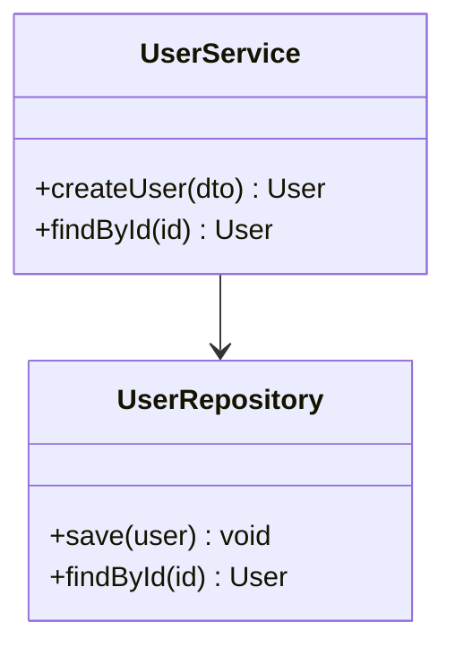

# /dc:diagram

## Objetivo

Analizar el código fuente del proyecto (imports, llamadas a funciones, modelos de datos, flujos) y producir automáticamente diagramas en formato Mermaid o C4. Elimina el mantenimiento manual de documentación visual y la mantiene sincronizada con el código real.

## Uso

```
/dc:diagram class
/dc:diagram sequence --file src/auth/login.ts
/dc:diagram architecture
/dc:diagram erd --dir src/models
/dc:diagram flowchart --feature checkout
/dc:diagram --output docs/arquitectura.md
```

## Comportamiento

1. **Determinar tipo** de diagrama solicitado
2. **Analizar** archivos relevantes según el tipo:
   - `class` → analizar definiciones de clase/interfaz e imports
   - `sequence` → analizar llamadas a funciones y flujo de ejecución
   - `architecture` → analizar módulos de alto nivel, dependencias y boundaries (C4 Context/Container)
   - `erd` → analizar modelos, entidades y relaciones
   - `flowchart` → analizar lógica de negocio de un flujo o feature
3. **Construir** el diagrama en sintaxis Mermaid
4. **Validar** que la sintaxis sea correcta (no generar Mermaid inválido)
5. **Guardar** como bloque en el archivo destino o imprimir en stdout

### Tipos de Diagrama

| Tipo | Mermaid | Fuente analizada |
|------|---------|-----------------|
| `class` | `classDiagram` | Clases, interfaces, herencia |
| `sequence` | `sequenceDiagram` | Llamadas, callbacks, async |
| `architecture` | C4 Context/Container | Módulos, boundaries, APIs externas |
| `erd` | `erDiagram` | Modelos, FK, relaciones |
| `flowchart` | `flowchart TD` | Lógica condicional, bifurcaciones |

### Reglas

- Máximo 20 nodos por diagrama para mantener legibilidad
- Si el scope es mayor, segmentar en subdiagramas por módulo
- Nunca inventar relaciones que no existen en el código
- Anotar la fecha de generación como comentario

## Output

````markdown
<!-- Generado por /dc:diagram — 2026-03-28 -->

````

> El bloque Mermaid se puede pegar directamente en README, docs o PR description y se renderiza en GitHub/GitLab.
