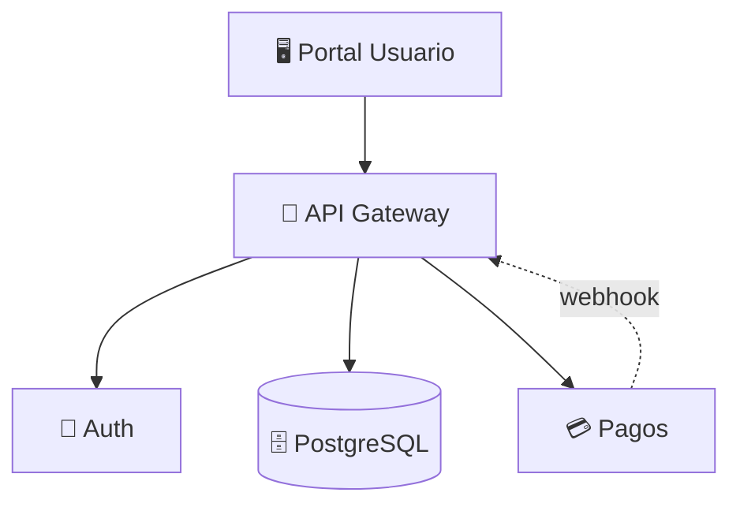

# Habilidad: Mapa Arquitectónico Vivo

**Versión:** 1.0.0
**Categoría:** Arquitectura
**Tipo:** Flexible

> Adaptado de DevilDev (lak7/devildev) — Architecture Map con componentes, conexiones y propiedad de código.

## Cómo Mejora el Framework

Don Cheli ya tiene specs, planes, y diseños técnicos. Pero le faltaba un **mapa visual de la arquitectura** que se mantiene actualizado automáticamente conforme el código cambia.

## Formato del Mapa

El mapa vive en `.especdev/arquitectura.md` y se actualiza con cada cambio:

```markdown
# Mapa Arquitectónico: mi-proyecto

Última actualización: 2026-03-21

## Componentes

| ID | Componente | Propósito | Stack | Archivos |
|----|-----------|-----------|-------|----------|
| auth | Sistema de Auth | Login, sesiones, permisos | NextAuth, JWT | src/services/auth/ |
| api | API Gateway | Endpoints REST | Next.js API Routes | src/app/api/ |
| db | Capa de Datos | Persistencia, queries | Prisma, PostgreSQL | src/db/ |
| ui | Portal de Usuario | Interfaz web | React 19, Tailwind | src/components/ |
| pay | Pagos | Cobros, suscripciones | Stripe | src/services/payment/ |

## Conexiones

| De → A | Flujo de Datos | Tipo |
|--------|---------------|------|
| ui → api | Requests HTTP | Síncrono |
| api → auth | Verificar token | Middleware |
| api → db | Queries SQL | Síncrono |
| api → pay | Crear cobro | Async |
| pay → api | Webhook evento | Async |

## Diagrama


```

## Propiedad de Código

Cada componente tiene un mapeo de propiedad con niveles de confianza:

| Confianza | Significado | Ejemplo |
|-----------|------------|---------|
| 0.8-1.0 | Implementación primaria | `src/services/auth/` para Auth |
| 0.5-0.79 | Soporte/relacionado | `src/utils/crypto/` para Auth |
| 0.2-0.49 | Dependencia compartida | `src/db/prisma.ts` para todos |

## Auto-Actualización

El mapa se actualiza cuando:
1. `/especdev:reversa` se ejecuta manualmente
2. `/especdev:archivar` completa un cambio
3. Git push (si `auto_sync: true` en WORKFLOW.md)

### Reglas de Actualización (De DevilDev)

1. **El árbol del repo es la fuente de verdad** — Si un directorio no existe, el componente se elimina
2. **Archivos eliminados → componente eliminado** — Si toda la implementación primaria se borra, el componente desaparece
3. **IDs estables** — Componentes sobrevivientes mantienen su ID original
4. **Conexiones válidas** — No referenciar componentes que ya no existen

## Comandos Relacionados

```
/especdev:reversa → generar mapa desde cero (para proyectos existentes)
/especdev:explorar → leer el mapa para entender el proyecto
/especdev:diseñar → proponer cambios al mapa (ADRs)
```
