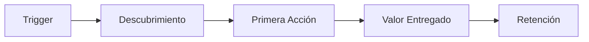
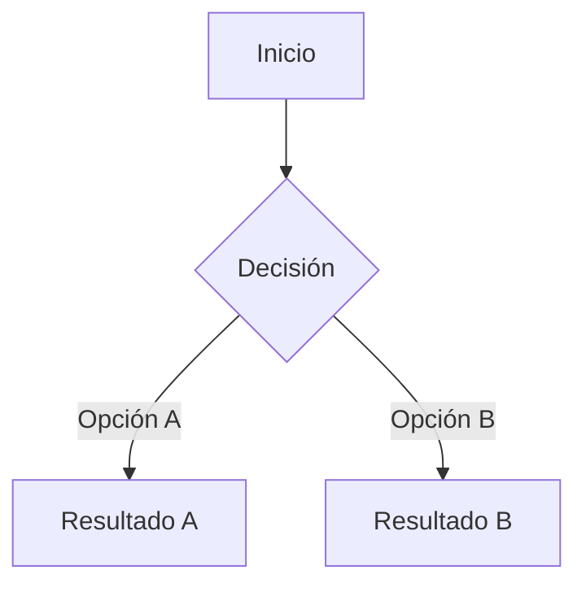

# PRD: [Nombre del Producto/Feature]

## Metadata

| Campo | Valor |
|-------|-------|
| Versión | 1.0 |
| Autor | |
| Fecha | |
| Estado | Draft |
| Stakeholders | |
| Deadline | |

---

## 1. Resumen Ejecutivo

_2-3 párrafos: qué se va a construir, por qué es importante, para quién, y cuándo se espera lanzar._

## 2. Problema

### 2.1 Contexto

_¿Qué está pasando hoy? ¿Por qué necesitamos esto?_

### 2.2 Pain Points

- **P1:** 
- **P2:** 
- **P3:** 

### 2.3 Evidencia

_Datos, research, feedback de usuarios, tickets de soporte, analytics._

| Fuente | Dato | Impacto |
|--------|------|---------|
| | | |

## 3. Objetivo y Métricas de Éxito

### 3.1 Objetivo principal

_Una oración que describe el resultado esperado._

### 3.2 KPIs

| KPI | Baseline | Target | Plazo |
|-----|----------|--------|-------|
| | | | |

### 3.3 North Star Metric

_La métrica única que define el éxito del producto._

## 4. Público Objetivo

### 4.1 User Personas

| Persona | Rol | Necesidad | Frecuencia de uso |
|---------|-----|-----------|-------------------|
| | | | |

### 4.2 Jobs-to-be-Done

_Cuando [situación], quiero [motivación], para poder [resultado esperado]._

### 4.3 User Journey



## 5. Solución Propuesta

### 5.1 Overview

_Descripción de alto nivel de la solución._

### 5.2 Flujo Principal



### 5.3 Referencia de Diseño

_Links a Figma, screenshots, wireframes._

### 5.4 Features por Prioridad

| # | Feature | MoSCoW | RICE Score | Esfuerzo |
|---|---------|--------|------------|----------|
| 1 | | Must | | |
| 2 | | Must | | |
| 3 | | Should | | |
| 4 | | Could | | |

## 6. Requirements Detallados

### 6.1 Funcionales

#### US-001: [User Story]

**Como** [persona], **quiero** [acción], **para** [beneficio].

**Criterios de aceptación:**

```gherkin
Escenario: [nombre]
  Dado que [contexto]
  Cuando [acción]
  Entonces [resultado]
```

### 6.2 No Funcionales

| Categoría | Requirement | Métrica |
|-----------|------------|---------|
| Performance | | < 200ms p95 |
| Seguridad | | OWASP Top 10 |
| Accesibilidad | | WCAG 2.1 AA |
| Disponibilidad | | 99.9% uptime |

### 6.3 Integraciones

| Sistema | Tipo | Dirección | Criticidad |
|---------|------|-----------|------------|
| | REST API | Bidireccional | Alta |

### 6.4 Data Model

```dbml
Table ejemplo {
  id uuid [pk]
  created_at timestamp [not null]
}
```

## 7. Diseño y UX

### 7.1 Análisis de Diseño

_Referencia a Figma con observaciones._

### 7.2 Estados de UI

| Estado | Diseñado | Notas |
|--------|----------|-------|
| Loading | ☐ | |
| Empty | ☐ | |
| Error | ☐ | |
| Success | ☐ | |
| Offline | ☐ | |

### 7.3 Responsive

| Breakpoint | Comportamiento |
|-----------|----------------|
| Desktop (1200px+) | |
| Tablet (768px) | |
| Mobile (375px) | |

## 8. Análisis de Riesgos

| # | Riesgo | Prob. | Impacto | Score | Mitigación |
|---|--------|-------|---------|-------|------------|
| R1 | | Media | Alto | 🟠 | |
| R2 | | Baja | Crítico | 🔴 | |
| R3 | | Alta | Medio | 🟡 | |

## 9. Scope

### 9.1 In Scope

- ✅ 
- ✅ 

### 9.2 Out of Scope (explícito)

- ❌ 
- ❌ 

### 9.3 Futuras Iteraciones

- v2: 
- v3: 

## 10. Timeline

| Fase | Entregable | Duración | Fecha |
|------|-----------|----------|-------|
| 1. Discovery | PRD + Specs | 1 semana | |
| 2. Build | MVP funcional | 2 semanas | |
| 3. Polish | QA + fixes | 1 semana | |
| 4. Launch | Deploy + monitoring | 2 días | |

## 11. Análisis Competitivo

| Feature | Nosotros | Competidor A | Competidor B |
|---------|----------|-------------|-------------|
| | ✅ | ❌ | ✅ |

## 12. Launch Plan

### 12.1 Rollout

- [ ] Feature flag creado
- [ ] 10% canary deployment
- [ ] 50% gradual rollout
- [ ] 100% GA

### 12.2 Monitoring

- [ ] Alertas configuradas
- [ ] Dashboard de métricas
- [ ] Error tracking (Sentry/similar)

### 12.3 Rollback

_Plan de rollback si algo sale mal._

## 13. Apéndices

### 13.1 Glosario

| Término | Definición |
|---------|-----------|
| | |

### 13.2 Referencias

- 

### 13.3 Historial de cambios

| Versión | Fecha | Cambio | Autor |
|---------|-------|--------|-------|
| 1.0 | | Creación inicial | |
