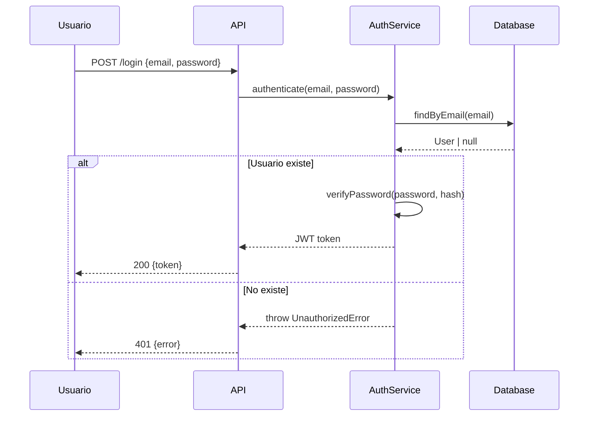

# Habilidad: Documentación Técnica Viva

**Versión:** 1.0.0
**Categoría:** Documentación
**Tipo:** Flexible

## Cómo Mejora el Framework

Don Cheli tiene devlog (registro cronológico) y trazabilidad (pipeline de artefactos), pero carece de un sistema para generar y mantener documentación técnica **que evoluciona con el código**: ADRs, specs OpenAPI, y documentación de decisiones.

## Tipos de Documentación

### 1. ADRs — Architecture Decision Records

Documentan el **por qué** detrás de decisiones técnicas.

```markdown
# ADR-001: Usar PostgreSQL en vez de MongoDB

**Estado:** Aceptado
**Fecha:** 2026-03-21
**Contexto:** Necesitamos una base de datos para el sistema de pedidos.
**Decisión:** Usar PostgreSQL 16.
**Consecuencias:**
  - (+) Transacciones ACID para pedidos
  - (+) JSON support para datos semi-estructurados
  - (-) Requiere schema upfront (menos flexible que Mongo)
  - (-) Más configuración inicial

**Alternativas evaluadas:**
  - MongoDB: descartada por falta de transacciones multi-documento nativas
  - SQLite: descartada por límites de concurrencia (ver PoC poc/sqlite-mvp/)
```

**Ubicación:** `.especdev/memoria/decisiones/ADR-###.md`

**Cuándo crear:**
- Elección de tecnología/librería
- Decisión arquitectónica (monolito vs micro, REST vs GraphQL)
- Trade-off significativo con alternativas válidas
- Checkpoint tipo `decisión` en `/dc:implementar`

**Cuándo NO crear:**
- Decisiones obvias sin alternativas reales
- Elecciones de estilo/formato
- Configuraciones menores

### 2. Specs OpenAPI / Swagger

Generación automática de especificaciones de API desde los contratos del plan.

**Trigger:** Después de `/dc:planificar-tecnico` si el plan incluye contratos API.

```yaml
# specs/api/openapi.yaml (auto-generado)
openapi: 3.1.0
info:
  title: Mi Proyecto API
  version: 1.0.0

paths:
  /api/v1/usuarios:
    post:
      summary: Crear usuario
      operationId: crearUsuario
      requestBody:
        required: true
        content:
          application/json:
            schema:
              $ref: '#/components/schemas/CrearUsuarioRequest'
      responses:
        '201':
          description: Usuario creado
          content:
            application/json:
              schema:
                $ref: '#/components/schemas/UsuarioResponse'
        '400':
          description: Datos inválidos
        '409':
          description: Email duplicado

components:
  schemas:
    CrearUsuarioRequest:
      type: object
      required: [email, password, nombre]
      properties:
        email:
          type: string
          format: email
        password:
          type: string
          minLength: 8
        nombre:
          type: string
          maxLength: 100
    UsuarioResponse:
      type: object
      properties:
        id:
          type: string
          format: uuid
        email:
          type: string
        nombre:
          type: string
        createdAt:
          type: string
          format: date-time
```

**Ubicación:** `specs/api/openapi.yaml`

**Auto-actualización:** Cuando `/dc:planificar-tecnico` genera un nuevo contrato API, el OpenAPI spec se actualiza automáticamente.

### 3. Docstrings/JSDoc Significativos

Guía para generar comentarios que aportan valor (no ruido).

```
✅ Documentar:
  - WHY (por qué existe esta función/clase)
  - Parámetros con tipos y restricciones
  - Excepciones que puede lanzar
  - Efectos secundarios (escribe en BD, envía email)
  - Invariantes y precondiciones

❌ NO documentar:
  - WHAT (qué hace — si el nombre no lo dice, renombrar)
  - Código obvio (// incrementar contador → i++)
  - Getters/setters triviales
  - Re-describir los tipos que ya son explícitos
```

**Ejemplo bueno:**
```python
def process_refund(payment_id: str, amount: Decimal | None = None) -> RefundResult:
    """Procesa reembolso total o parcial via Stripe.

    Si amount es None, reembolsa el total. Reembolsos parciales
    acumulativos no pueden exceder el monto original.

    Raises:
        PaymentNotFoundError: payment_id no existe
        RefundExceedsPaymentError: monto acumulado > original
        StripeError: error de comunicación con Stripe (auto-retry 3x)

    Side effects:
        - Crea registro en tabla refunds
        - Envía email de confirmación al usuario (async)
    """
```

### 4. Diagramas como Código

Usar Mermaid para diagramas que viven con el código:

```markdown
## Flujo de Autenticación


```

**Ubicación:** Inline en specs, plans, o ADRs.

## Ciclo de Vida de la Documentación

```
Código cambia → ¿Docs afectadas?
├── API cambió → Actualizar OpenAPI
├── Decisión arquitectónica → Crear/actualizar ADR
├── Nuevo módulo → Actualizar mapa arquitectónico
├── Nuevo flujo → Agregar diagrama Mermaid
└── Solo lógica interna → No requiere docs
```

## Verificación de Frescura

| Documento | Frecuencia de verificación | Cómo verificar |
|-----------|---------------------------|----------------|
| OpenAPI | Cada PR con cambio de API | Diff entre spec y código |
| ADRs | Cada fase de Estrategia | ¿Decisiones siguen vigentes? |
| Diagramas | Cada cambio arquitectónico | ¿Flujo coincide con código? |
| README | Cada release | ¿Instrucciones funcionan? |

## Integración con Pipeline

```
/dc:planificar-tecnico → genera OpenAPI si hay API
/dc:implementar (checkpoint:decisión) → genera ADR
/dc:revisar → verifica frescura de docs
/dc:archivar → snapshot de docs con versión
```

## Guardrails

- **Nunca** duplicar información entre docs — referenciar con links
- **Nunca** documentar código obvio (renombrar en vez de comentar)
- **Siempre** crear ADR para decisiones con alternativas válidas
- **Siempre** actualizar OpenAPI cuando cambia un contrato de API
- **Máximo** ~200 líneas por documento (constitución Art. de concisión)
